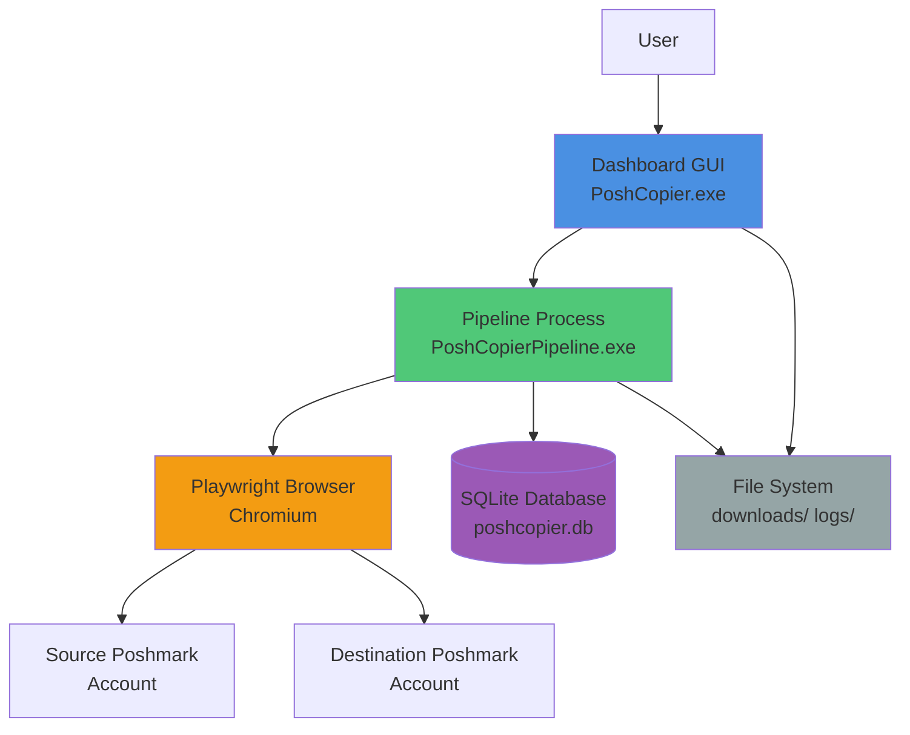
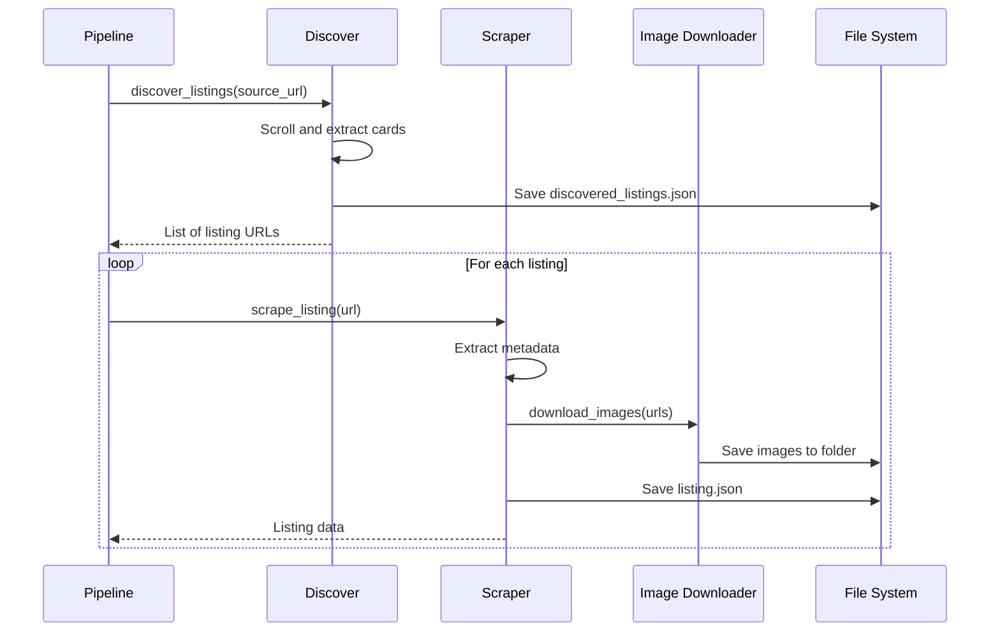
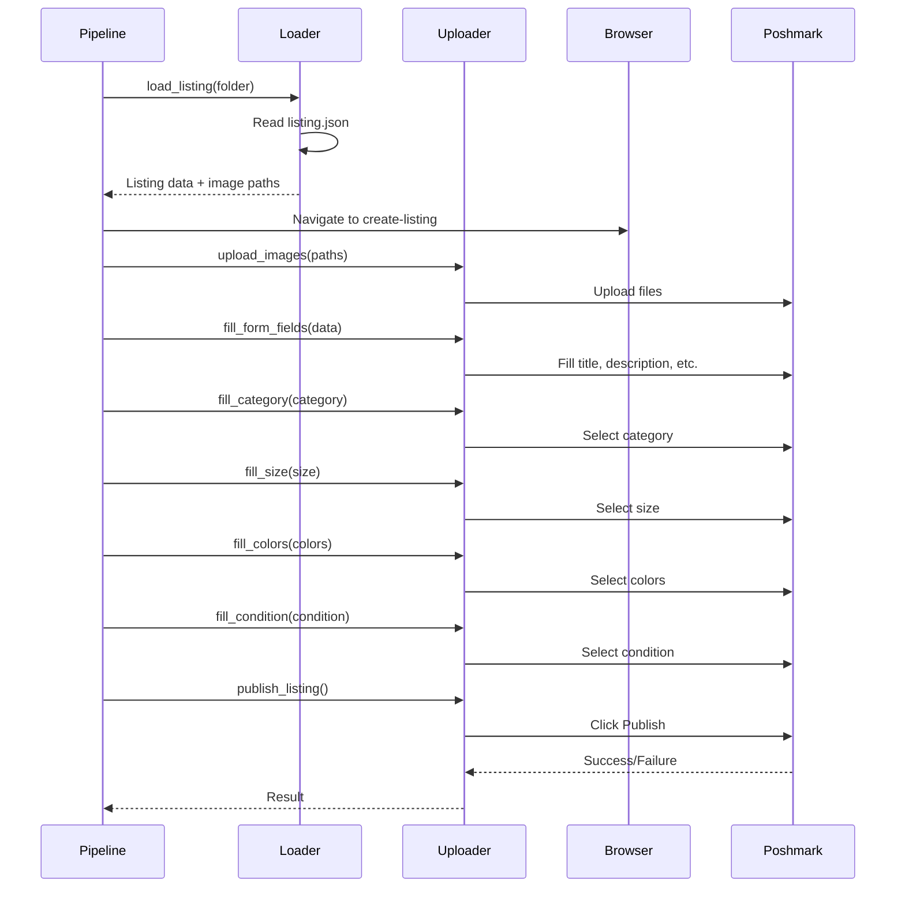

# PoshCopier - Architecture

## System Architecture

PoshCopier follows a multi-process architecture with a GUI dashboard that spawns and monitors a separate pipeline process.



## Component Architecture

### 1. Dashboard Layer

**Entry Point**: [`app.py`](../app.py)

**Main Component**: [`dashboard/dashboard.py`](../dashboard/dashboard.py) - `PoshCopierDashboard`

**Responsibilities**:
- Provide user interface for pipeline configuration
- Spawn and monitor the pipeline subprocess
- Display real-time progress and statistics
- Handle user control commands (pause, resume, stop)
- Manage inventory viewing and health checks

**Sub-components**:
- [`dashboard/controls.py`](../dashboard/controls.py) - Control buttons and settings
- [`dashboard/status_panel.py`](../dashboard/status_panel.py) - Current status display
- [`dashboard/progress_panel.py`](../dashboard/progress_panel.py) - Progress bars and statistics
- [`dashboard/activity_log.py`](../dashboard/activity_log.py) - Real-time log viewer
- [`dashboard/inventory_panel.py`](../dashboard/inventory_panel.py) - Inventory browser
- [`dashboard/thumbnail_panel.py`](../dashboard/thumbnail_panel.py) - Image thumbnails
- [`dashboard/recovery_panel.py`](../dashboard/recovery_panel.py) - Broken folder recovery
- [`dashboard/pipeline_io.py`](../dashboard/pipeline_io.py) - Parse pipeline output

### 2. Pipeline Layer

**Entry Point**: [`pipeline_entry.py`](../pipeline_entry.py)

**Main Component**: [`run_pipeline.py`](../run_pipeline.py) - `main()`

**Responsibilities**:
- Orchestrate the end-to-end listing copy workflow
- Manage browser automation sessions
- Handle errors and retries
- Emit structured status events for the dashboard
- Respect control signals (pause, resume, stop)
- Maintain resume state for interrupted runs

**Workflow Stages**:
1. **Initialization**: Load authentication, initialize database
2. **Discovery**: Collect available listings from source closet
3. **Processing Loop**: For each listing:
   - Check if already copied (database + duplicate detection)
   - Scrape listing details
   - Download images
   - Upload to destination (if not dry run)
   - Record completion
4. **Cleanup**: Save final state, close browsers

### 3. Scraper Layer

**Location**: [`scraper/`](../scraper/)

**Components**:

- **[`discover.py`](../scraper/discover.py)**: Discover available listings from source closet
  - Scroll through closet pages
  - Extract listing cards
  - Classify availability status
  - Save to `discovered_listings.json`

- **[`listing_scraper.py`](../scraper/listing_scraper.py)**: Extract listing details
  - Navigate to listing page
  - Parse JSON-LD structured data
  - Extract title, description, price, brand, size, category, colors, condition
  - Verify listing availability

- **[`parser.py`](../scraper/parser.py)**: Parse and clean extracted data
  - Clean text content
  - Extract structured fields from description
  - Normalize values

- **[`image_downloader.py`](../scraper/image_downloader.py)**: Download listing images
  - Fetch images from URLs
  - Save to listing folder
  - Handle retries and errors

- **[`availability.py`](../scraper/availability.py)**: Classify listing availability
  - Detect sold, unavailable, or inactive listings
  - Parse status badges and text

- **[`save_listing.py`](../scraper/save_listing.py)**: Save listing data
  - Create listing folder structure
  - Write `listing.json`
  - Mark as copied locally

- **[`size_extractor.py`](../scraper/size_extractor.py)**: Extract size information
  - Parse size from title and description
  - Handle multi-size inventory

### 4. Uploader Layer

**Location**: [`uploader/`](../uploader/)

**Components**:

- **[`listing_loader.py`](../uploader/listing_loader.py)**: Load listing data from disk
  - Read `listing.json`
  - Locate image files
  - Validate data completeness

- **[`image_uploader.py`](../uploader/image_uploader.py)**: Upload images to form
  - Locate file input element
  - Upload multiple images
  - Wait for upload completion

- **[`form_fields.py`](../uploader/form_fields.py)**: Fill basic form fields
  - Title, description, price, brand
  - Handle various selector strategies
  - Close modals and popups

- **[`category.py`](../uploader/category.py)**: Select category dropdown
- **[`colors.py`](../uploader/colors.py)**: Select color options
- **[`condition.py`](../uploader/condition.py)**: Select condition
- **[`size.py`](../uploader/size.py)**: Select size
- **[`multi_size.py`](../uploader/multi_size.py)**: Handle multi-size inventory

- **[`duplicate_detector.py`](../uploader/duplicate_detector.py)**: Detect existing listings
  - Collect destination closet URLs
  - Compare titles for duplicates
  - Prevent re-uploading

- **[`publisher.py`](../uploader/publisher.py)**: Publish the listing
  - Click "Next" buttons
  - Find and click "Publish" button
  - Verify publication success

- **[`verifier.py`](../uploader/verifier.py)**: Verify uploaded listing
  - Check for success indicators
  - Extract destination listing URL

### 5. Inventory Layer

**Location**: [`inventory/`](../inventory/)

**Components**:

- **[`inventory_manager.py`](../inventory/inventory_manager.py)**: Load and manage inventory
  - Scan downloads directory
  - Load listing metadata
  - Build inventory items

- **[`inventory_item.py`](../inventory/inventory_item.py)**: Data model for inventory items
  - Listing metadata
  - Upload status flags
  - Health status

- **[`inventory_health.py`](../inventory/inventory_health.py)**: Validate listing data
  - Check JSON validity
  - Verify required fields
  - Check image availability
  - Generate health reports

- **[`recovery_manager.py`](../inventory/recovery_manager.py)**: Identify broken listings
  - Scan for invalid folders
  - Provide recovery options
  - Delete or repair broken items

- **[`thumbnail_cache.py`](../inventory/thumbnail_cache.py)**: Generate and cache thumbnails
  - Create thumbnail images
  - Cache for performance

### 6. Data Layer

**Location**: [`data/database/`](../data/database/)

**Component**: [`database.py`](../data/database/database.py)

**Functions**:
- `initialize_database()`: Create tables
- `listing_already_copied(source_listing_id)`: Check if copied
- `mark_listing_copied(source_listing_id, destination_listing_id, title)`: Record copy

**Schema**:
```sql
CREATE TABLE copied_listings (
    id INTEGER PRIMARY KEY AUTOINCREMENT,
    source_listing_id TEXT UNIQUE NOT NULL,
    destination_listing_id TEXT,
    title TEXT,
    copied_at TIMESTAMP DEFAULT CURRENT_TIMESTAMP
)
```

### 7. Control Layer

**Components**:

- **[`pipeline_control.py`](../pipeline_control.py)**: Inter-process control
  - Write control state to `logs/pipeline_control.json`
  - Dashboard writes commands (pause, resume, stop)
  - Pipeline reads and respects commands
  - Atomic file operations for thread safety

- **[`resume_state.py`](../resume_state.py)**: Resume interrupted runs
  - Save progress to `logs/resume_state.json`
  - Track completed listing IDs
  - Load state on restart
  - Skip already-processed listings

### 8. Authentication Layer

**Component**: [`login.py`](../login.py)

**Functions**:
- `save_source_login()`: Save source account session
- `save_destination_login()`: Save destination account session
- `open_logged_in_browser()`: Create authenticated browser context

**Storage**: Playwright storage state JSON files
- `source_state.json`
- `destination_state.json`

### 9. Runtime Paths Layer

**Component**: [`runtime_paths.py`](../runtime_paths.py)

**Responsibilities**:
- Detect execution mode (development vs packaged)
- Resolve paths for both modes
- Configure Playwright browser directory
- Ensure runtime directories exist

**Key Paths**:
- `APP_DIR`: Application root directory
- `DOWNLOADS_DIR`: Listing storage
- `LOGS_DIR`: Log files
- `ERRORS_DIR`: Error logs
- `DATABASE_FILE`: SQLite database
- `PLAYWRIGHT_BROWSERS_DIR`: Browser binaries

## Data Flow

### Scraping Flow



### Upload Flow



## Error Handling

- **Retry Logic**: Configurable retries with delays for transient failures
- **Error Logging**: Stack traces saved to `logs/errors/`
- **Graceful Degradation**: Continue with next listing on failure
- **Resume Capability**: Save state to resume after crashes
- **Validation**: Pre-upload validation to catch issues early

## Concurrency Model

- **Single-threaded Pipeline**: One listing processed at a time
- **Multi-process**: Dashboard and pipeline run in separate processes
- **Thread-safe Control**: Atomic file operations for control state
- **Queue-based Communication**: Dashboard reads pipeline stdout via queue

## Browser Automation

- **Tool**: Playwright (Chromium)
- **Mode**: Headless (configurable)
- **Sessions**: Separate contexts for source and destination
- **Storage State**: Persistent login sessions
- **Selectors**: Multiple fallback strategies for robustness
