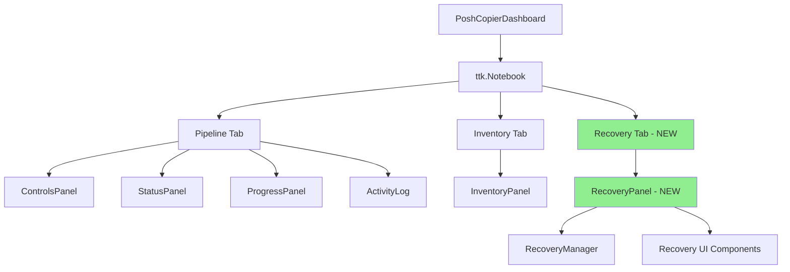

# TASK-001: Integrate Recovery Center

## Objective
Integrate the existing [`RecoveryPanel`](../dashboard/recovery_panel.py:16) into the main dashboard by adding it as a new notebook tab.

## Current State Analysis

### Dashboard Structure
The [`dashboard.py`](../dashboard/dashboard.py:1) file contains the main [`PoshCopierDashboard`](../dashboard/dashboard.py:43) class which:
- Uses a ttk.Notebook widget (created at line 98)
- Currently has two tabs:
  1. **Pipeline** tab (lines 106-109, added at lines 115-118)
  2. **Inventory** tab (lines 110-113, added at lines 119-122)

### RecoveryPanel Structure
The [`RecoveryPanel`](../dashboard/recovery_panel.py:16) class:
- Inherits from `ttk.LabelFrame`
- Constructor signature: `__init__(self, parent: tk.Misc) -> None`
- Takes only one parameter: `parent` (the parent widget)
- Self-initializes with `_build_interface()` and `refresh()` calls
- Is already a complete, self-contained UI component

### Current Imports
The dashboard currently imports:
- [`ActivityLog`](../dashboard/dashboard.py:12) from `dashboard.activity_log`
- [`InventoryPanel`](../dashboard/dashboard.py:13) from `dashboard.inventory_panel`
- [`ControlsPanel`](../dashboard/dashboard.py:14) from `dashboard.controls`
- Other dashboard components

**Missing**: Import for `RecoveryPanel` from `dashboard.recovery_panel`

## Implementation Plan

### Changes Required in [`dashboard/dashboard.py`](../dashboard/dashboard.py:1)

#### 1. Add Import Statement (Line 13-14)
**Location**: After the `InventoryPanel` import, before `ControlsPanel`

```python
from dashboard.inventory_panel import InventoryPanel
from dashboard.recovery_panel import RecoveryPanel  # NEW
from dashboard.controls import ControlsPanel
```

#### 2. Create Recovery Tab Frame (Line 113)
**Location**: Immediately after `inventory_tab` definition, before notebook.add() calls

```python
inventory_tab = ttk.Frame(
    notebook,
    padding=0,
)
recovery_tab = ttk.Frame(  # NEW
    notebook,                # NEW
    padding=0,               # NEW
)                            # NEW
```

#### 3. Add Recovery Tab to Notebook (Line 122)
**Location**: Immediately after the Inventory tab is added to the notebook

```python
notebook.add(
    inventory_tab,
    text="Inventory",
)
notebook.add(              # NEW
    recovery_tab,          # NEW
    text="Recovery",       # NEW
)                          # NEW
```

#### 4. Instantiate and Pack RecoveryPanel (Line 360)
**Location**: After the InventoryPanel instantiation and packing

```python
self.inventory_panel = InventoryPanel(
    inventory_tab
)
self.inventory_panel.pack(
    fill="both",
    expand=True,
)

self.recovery_panel = RecoveryPanel(  # NEW
    recovery_tab                      # NEW
)                                     # NEW
self.recovery_panel.pack(             # NEW
    fill="both",                      # NEW
    expand=True,                      # NEW
)                                     # NEW
```

## Code Changes Summary

### Modified Lines
- **Line ~13**: Add import for `RecoveryPanel`
- **Line ~113**: Create `recovery_tab` Frame
- **Line ~122**: Add `recovery_tab` to notebook
- **Line ~360**: Instantiate and pack `RecoveryPanel`

### Total Changes
- **1 new import statement**
- **3 new code blocks** (tab frame, notebook.add, panel instantiation)
- **~10 lines of code added**
- **0 lines modified** (all additions)
- **0 lines deleted**

## Verification Steps

### 1. Syntax Check
```bash
python -m py_compile dashboard\dashboard.py
```

Expected result: No output (successful compilation)

### 2. Visual Verification
After running the application:
- Dashboard should display 3 tabs: "Pipeline", "Inventory", "Recovery"
- Recovery tab should be positioned after Inventory tab
- Clicking Recovery tab should display the Recovery Center interface
- All existing functionality should remain unchanged

### 3. Functional Testing
- Pipeline tab: Start/stop pipeline operations work
- Inventory tab: Inventory management works
- Recovery tab: Recovery center displays broken folders
- Tab switching works smoothly without errors

## Risk Assessment

### Low Risk
- **Isolated changes**: Only adding new functionality, not modifying existing code
- **Self-contained component**: RecoveryPanel is already fully implemented
- **Consistent pattern**: Following the exact same pattern as InventoryPanel integration
- **No dependencies**: RecoveryPanel doesn't interact with other dashboard components

### Potential Issues
1. **Import errors**: If `dashboard.recovery_panel` module has issues
   - Mitigation: Module already exists and is complete
2. **Layout issues**: If RecoveryPanel doesn't render properly
   - Mitigation: RecoveryPanel already inherits from ttk.LabelFrame and handles its own layout

## Rollback Plan
If issues occur, simply revert the 4 changes:
1. Remove the import statement
2. Remove the `recovery_tab` Frame creation
3. Remove the `notebook.add(recovery_tab, ...)` call
4. Remove the RecoveryPanel instantiation and packing

## Success Criteria
- ✅ Code compiles without errors
- ✅ Dashboard launches successfully
- ✅ Recovery tab appears in the notebook
- ✅ Recovery tab is positioned after Inventory tab
- ✅ RecoveryPanel displays correctly when tab is selected
- ✅ All existing Pipeline and Inventory functionality preserved
- ✅ No runtime errors or warnings

## Architecture Diagram



## Implementation Notes

### Code Style Consistency
The implementation follows the existing code style in [`dashboard.py`](../dashboard/dashboard.py:1):
- 4-space indentation
- Type hints using `from __future__ import annotations`
- Consistent widget creation patterns
- Consistent packing parameters (`fill="both"`, `expand=True`)

### Naming Conventions
- Tab variable: `recovery_tab` (matches `pipeline_tab`, `inventory_tab`)
- Panel instance: `self.recovery_panel` (matches `self.inventory_panel`)
- Tab text: `"Recovery"` (matches `"Pipeline"`, `"Inventory"`)

### Integration Pattern
The integration follows the exact same pattern used for [`InventoryPanel`](../dashboard/dashboard.py:354):
1. Create tab frame with `padding=0`
2. Add tab to notebook with descriptive text
3. Instantiate panel with tab as parent
4. Pack panel with `fill="both"` and `expand=True`

This ensures consistency and maintainability.
